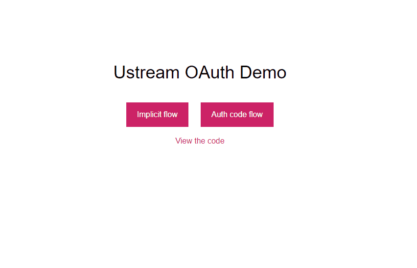

# Ustream Oauth Demo
This app demonstrates how to authenticate clients with Ustream's oauth API and the [ustream nodejs sdk](https://github.com/MichaelJamesParsons/ustream-nodejs-sdk). Two oauth flows are featured in this demo:

> **Implicit flow**
>Suitable for standalone, native clients (desktop / mobile). The user enters its credentials to a secure login webpage. After logging in, the browser is redirected to a special URL (defined by the client), passing the access token in the URL.
> -- <cite>[Ustream Documentation][1]</cite>

> **Authorization code flow**
> Suitable for third-party websites which contain a client and a server component. The user enters its credentials to a secure login webpage. After logging in, the browser is redirected to a special URL (defined by the client), passing an authorization code in the URL. The third-party server obtains the access token with another HTTP request in the background, using the authorization code. This method is more secure than the implicit flow if the third-party client has a client+server model. See the OAuth2 Draft for details.
> -- <cite>[Ustream Documentation][1]</cite>

[1]:http://developers.video.ibm.com/channel-api/getting-started.html

An example of the third type of flow, `client credentials flow` can be found in the [ustream nodejs sdk readme](https://github.com/MichaelJamesParsons/ustream-nodejs-sdk). You can find more information about authentication flows in the [official ustream docs](http://developers.video.ibm.com/channel-api/getting-started.html).

## Live Demo

[View Demo](http://ustream.michaeljamesbondparsons.com)

## Installation

### Install dependencies.
```
yarn install
```

### Set environment variables.

```
USTREAM_CLIENT_ID - Your ustream client ID.
USTREAM_CLIENT_SECRET - Your ustream client secret.
USTREAM_REDIRECT_URI - https://yourdomain.com/channels
```

> The value of `USTREAM_REDIRECT_URI` must exactly match the redirect uri you set when creating your Ustream API credentials.
>
> This demo expects the user to be redirected to the `/channels` endpoint after logging in to their Ustream account.

## Run the app
The app will run on port `3000`. It must be hosted on a webserver that ustream can access (localhost will not work).

```
npm start
```

## Using the app

